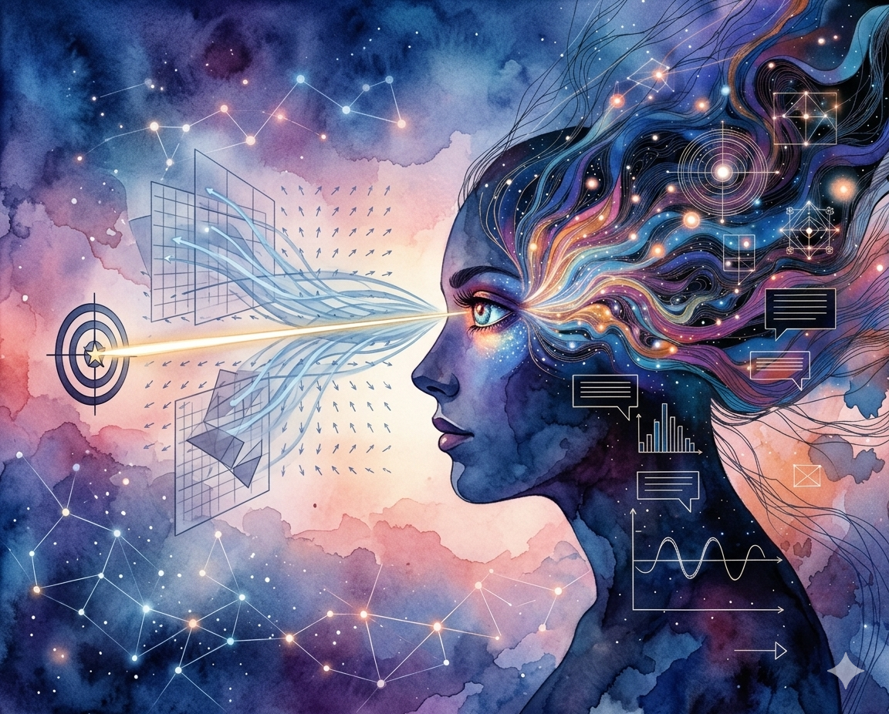
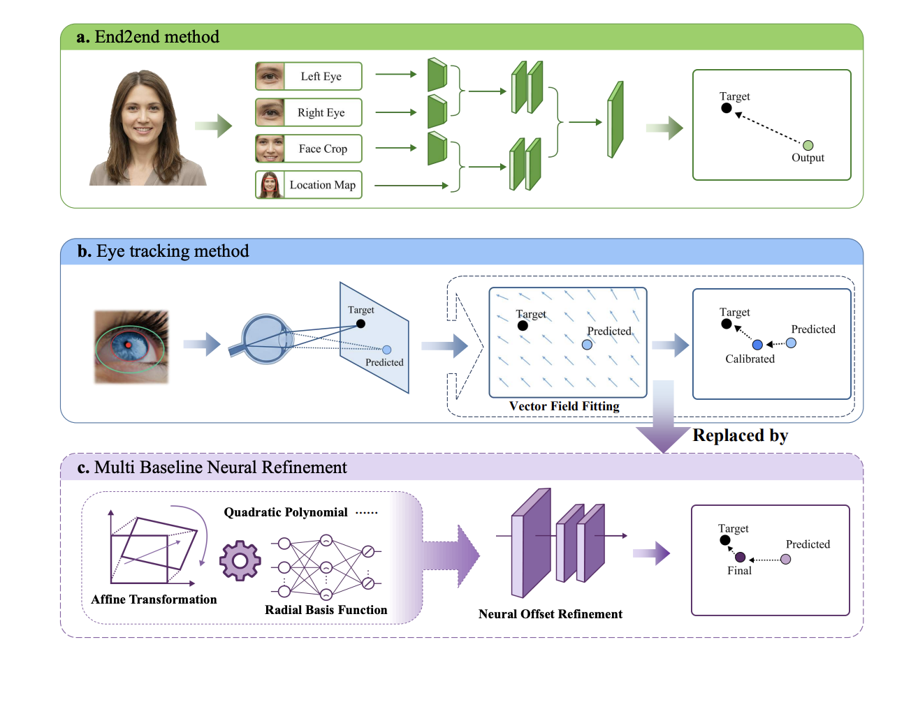

# A Lightweight Neural Refinement Framework for Drift Calibration in Eye Tracking Systems

<p align="center">

</p>

[](LICENSE)
[](https://pupil-labs.com/)
[](https://www.python.org/)

## Overview

While end-to-end gaze estimation has seen rapid development, model-based geometric eye-tracking approaches remain indispensable for high-accuracy performance. Existing calibration methods for mitigating eye-tracking system drift typically rely on a single global mapping function, which lacks the flexibility to model spatially varying drift patterns encountered in real-world usage.

**GazeRefineNet** proposes a lightweight neural refinement framework that:

1. **Combines traditional calibration methods** (Polynomial, Affine Transformation, RBF) with deep learning refinement
2. **Achieves state-of-the-art accuracy** on both self-collected and public (JuDo1000) datasets
3. **Validates in real-world scenarios** through an interactive gaze-controlled music game

<p align="center">

</p>

### Key Innovation: Multi-Baseline Neural Refinement

Our method progressively refines gaze estimates by:
- First applying traditional model-based calibration (Affine + RBF achieves best baseline performance)
- Then using a lightweight neural network to learn residual corrections
- Training with **noise-aware augmentation** to improve robustness against calibration quality variations

## Calibration Performance

State-of-the-art accuracy validated on both self-collected and public JuDo1000 datasets.

| Dataset | Method | Mean Error | Δ vs Baseline |
|---------|--------|------------|---------------|
| **Self-Collected** (12 participants, 163 trials) | Raw (Baseline) | 1.53° / 67.3 px | — |
| | Polynomial | 1.11° / 48.9 px | -27.3% |
| | Affine | 1.15° / 50.5 px | -25.0% |
| | Affine + RBF | 1.03° / 45.5 px | -32.3% |
| | **GazeRefineNet** | **0.96° / 42.3 px** | **-37.2%** |
| **JuDo1000** (150 participants, 600+ trials) | Raw (Baseline) | 22.0 px | — |
| | Similarity | 21.7 px | -1.4% |
| | **GazeRefineNet** | **5.8 px** | **-73.6%** |

**Key Achievements:**
- Sub-degree accuracy (0.96°) on self-collected dataset
- 73.6% error reduction on public JuDo1000 dataset
- Validated in real-world gaze-controlled music game

### Real-World Game Validation

**Experiment Setup:**
- **Music Rhythm Game**: "Dance of the Golden Snake" with 17 musical note circles (C3 to D5 range)
- **Scoring**: Based on fixation duration on illuminated circles (0.7s localization window excluded)
- **Result**: Significant improvement in game scores compared to baseline calibration methods

### Dataset Format

**Our collected dataset:**
- **Participants**: 12 participants (5 males, 7 females, aged 18–25 years)
- **Trials**: 163 total trials after filtering
- **Validation**: Also tested on public JuDo1000 dataset (150 participants, 600+ trials)

**Calibration CSV columns:**
- `target_x`, `target_y`: Ground truth coordinates (pixels)
- `original_gaze_x`, `original_gaze_y`: Raw eye tracker gaze
- `sim_rbf_gaze_x`, `sim_rbf_gaze_y`: SimRBF-corrected gaze (cascade mode)
- `spread`: Sample standard deviation (for weighting)

## Methodology

### Calibration Models (Cascading Pipeline)

Our system progressively refines gaze estimates through multiple stages:

1. **Polynomial Model**: 2nd-order polynomial surface fitting with ridge regression
2. **Affine Transformation (Similarity)**: Procrustes alignment for global rotation, scaling, and translation
3. **RBF Model**: Radial Basis Function with multiquadric kernel for local residual interpolation
4. **Neural Refinement**: ResNet-style network trained on residuals from multiple baselines

### Mathematical Formulations

## Requirements

**Hardware:**
- Pupil Labs Core eye tracker (monocular, right eye)
- ~24-inch Display
- A single cpu laptop for running calibration software and network training

## Installation

```bash
cd apps/neural_refine
uv sync
source .venv/bin/activate
conda env create -f apps/model_calibration/environment.yaml
conda activate gazetoword
```

## 💻 Running Calibration Pipeline

### Data Collection

**Run data collection:**

```bash
conda activate gazetoword
python apps/model_calibration/systematic_drift_calibration.py
```

### Network Training

**Configuration files** in `apps/neural_refine/config/`:
- `end_to_end.yaml`: Direct training from original gaze to residuals
- `cascade.yaml`: Two-stage training (baseline → neural refinement)

```bash
# End-to-end training
python apps/neural_refine/main.py --config config/end_to_end.yaml

# Cascade training (recommended)
python apps/neural_refine/main.py --config config/cascade.yaml
```

**Key Training Features:**
- **SimRBF Perturbation Augmentation**: Simulates varying calibration quality
- **Noise-aware Training**: Gaussian noise (σ=20px) + uniform bias (±30px)
- **Feature Ensemble**: Multiple baseline hypotheses for robust prediction

### Evaluation

```bash
# Evaluate original gaze error (baseline)
python scripts/eval.py original data/prepared/split_avg_data/test.csv

# Evaluate SimRBF calibration
python scripts/eval.py sim_rbf data/prepared/split_avg_data/test.csv

# Evaluate neural-refined predictions
python scripts/eval.py pred_gaze outputs/predictions_test.csv
```

### Demo Game (Interactive Validation)

```bash
python apps/demo_game/run_demo_game.py
```

A music rhythm game where gaze controls note selection - demonstrates real-world calibration quality.

## 📁 Project Structure

```
GazeRefineNet/
├── apps/
│   ├── neural_refine/          # Neural network training & inference
│   │   ├── config/              # Training configurations (cascade.yaml, end_to_end.yaml)
│   │   ├── src/                 # Model definitions (GazeRefineNet)
│   │   ├── main.py              # Training entry point
│   │   └── analysis/            # Analysis scripts for residual patterns
│   ├── model_calibration/       # Data collection & traditional methods
│   │   ├── systematic_drift_calibration.py  # 18-point grid calibration
│   │   └── environment.yaml     # Conda dependencies
│   ├── demo_game/               # Interactive gaze validation game
│   └── data_process/            # Data cleaning and train/val/test splitting
├── data/
│   ├── prepared/                # Processed calibration data (train/val/test.csv)
│   └── raw/                     # Raw gaze logs
├── checkpoints/                 # Trained model weights
├── scripts/
│   └── eval.py                  # Evaluation script for all methods
└── tex/                         # Paper LaTeX source
```

## License

MIT License - see [LICENSE](LICENSE) file for details

---

## Citation

```bibtex
@software{gazerefinenet2025,
  title = {Lightweight Neural Refinement for Drift Calibration in Eye Tracking Systems},
  author = {Liu, J. and Wang, Z. and Zhang, Y. and Liang, D. and Li, J. H. and Jung, T.-P. and Cauwenberghs, G.},
  year = {2025},
  url = {incoming arxiv},
  license = {MIT}
}
```

## Acknowledgments

This work was fully supported by the Swartz Center for Computational Neuroscience (SCCN) at the University of California San Diego (UCSD) during the internship of Jiaqi Liu and Zixuan Wang. We thank all participants who volunteered in our data collection experiments.
