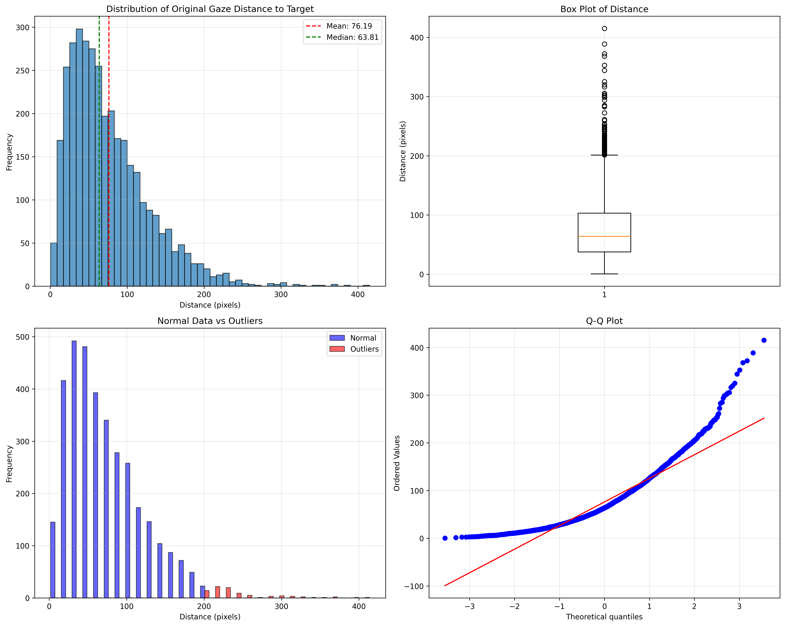
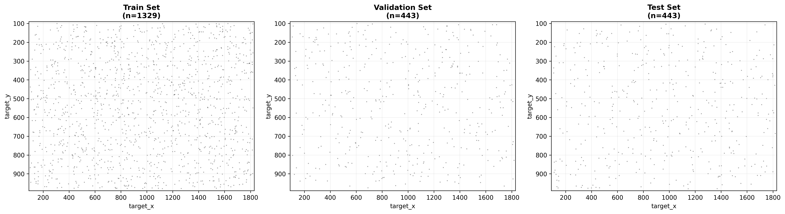

# Data Preprocessing

This module contains scripts for preprocessing raw gaze tracking data into formats suitable for model training and evaluation.

## Overview

The data preprocessing pipeline handles cleaning, filtering, and splitting of eye-tracking data collected during calibration sessions. It prepares the data for use in both traditional calibration models and neural network refinement.

## Data with Rawn Fixation Points

Raw data in path:

```bash
data/raw/all/all_trials_model_predictions_0111.csv
```

which contains data in form of 

```csv
subject,timestamp,target_index,origin_gaze_x,origin_gaze_y,target_x,target_y,spread,n_samples,pred_similarity_x,pred_similarity_y,pred_poly_x,pred_poly_y,pred_rbf_thin_plate_s1.0_x,pred_rbf_thin_plate_s1.0_y,pred_rbf_multiquadric_s0.0_x,pred_rbf_multiquadric_s0.0_y,pred_rbf_multiquadric_s1.0_x,pred_rbf_multiquadric_s1.0_y,pred_rbf_multiquadric_s2.0_x,pred_rbf_multiquadric_s2.0_y,pred_tps_x,pred_tps_y,pred_pwa_x,pred_pwa_y,pred_gpr_x,pred_gpr_y,pred_sim_rbf_thin_plate_s1.0_x,pred_sim_rbf_thin_plate_s1.0_y,pred_sim_rbf_multiquadric_s0.0_x,pred_sim_rbf_multiquadric_s0.0_y,pred_sim_rbf_multiquadric_s1.0_x,pred_sim_rbf_multiquadric_s1.0_y,pred_sim_rbf_multiquadric_s2.0_x,pred_sim_rbf_multiquadric_s2.0_y,pred_sim_tps_x,pred_sim_tps_y,pred_sim_pwa_x,pred_sim_pwa_y,pred_sim_gpr_x,pred_sim_gpr_y,test_x_0,test_y_0,test_x_1,test_y_1,test_x_2,test_y_2,test_x_3,test_y_3,test_x_4,test_y_4,test_x_5,test_y_5,test_x_6,test_y_6,test_x_7,test_y_7,test_x_8,test_y_8,test_x_9,test_y_9,test_x_10,test_y_10,test_x_11,test_y_11,test_x_12,test_y_12,test_x_13,test_y_13,test_x_14,test_y_14,test_x_15,test_y_15,test_x_16,test_y_16,test_x_17,test_y_17,test_x_18,test_y_18,test_x_19,test_y_19,test_x_20,test_y_20,test_x_21,test_y_21,test_x_22,test_y_22,test_x_23,test_y_23,test_x_24,test_y_24,test_x_25,test_y_25,test_x_26,test_y_26,test_x_27,test_y_27,test_x_28,test_y_28,test_x_29,test_y_29,test_x_30,test_y_30,test_x_31,test_y_31,test_x_32,test_y_32,test_x_33,test_y_33,test_x_34,test_y_34,test_x_35,test_y_35,test_x_36,test_y_36,test_x_37,test_y_37,test_x_38,test_y_38,test_x_39,test_y_39,test_x_40,test_y_40,test_x_41,test_y_41,test_x_42,test_y_42,test_x_43,test_y_43,test_x_44,test_y_44,test_x_45,test_y_45,test_x_46,test_y_46,test_x_47,test_y_47,test_x_48,test_y_48,test_x_49,test_y_49,test_x_50,test_y_50,test_x_51,test_y_51,test_x_52,test_y_52,test_x_53,test_y_53,test_x_54,test_y_54,test_x_55,test_y_55,test_x_56,test_y_56,test_x_57,test_y_57,test_x_58,test_y_58,test_x_59,test_y_59,test_x_60,test_y_60,test_x_61,test_y_61,test_x_62,test_y_62,test_x_63,test_y_63,test_x_64,test_y_64,test_x_65,test_y_65,test_x_66,test_y_66,test_x_67,test_y_67,test_x_68,test_y_68,test_x_69,test_y_69,test_x_70,test_y_70,test_x_71,test_y_71,test_x_72,test_y_72,test_x_73,test_y_73,test_x_74,test_y_74,test_x_75,test_y_75,test_x_76,test_y_76,test_x_77,test_y_77,test_x_78,test_y_78,test_x_79,test_y_79,test_x_80,test_y_80,test_x_81,test_y_81,test_x_82,test_y_82,test_x_83,test_y_83,test_x_84,test_y_84,test_x_85,test_y_85,test_x_86,test_y_86,test_x_87,test_y_87,test_x_88,test_y_88,test_x_89,test_y_89,test_x_90,test_y_90,test_x_91,test_y_91,test_x_92,test_y_92,test_x_93,test_y_93,test_x_94,test_y_94,test_x_95,test_y_95,test_x_96,test_y_96,test_x_97,test_y_97,test_x_98,test_y_98,test_x_99,test_y_99,test_x_100,test_y_100,test_x_101,test_y_101,test_x_102,test_y_102,test_x_103,test_y_103,test_x_104,test_y_104,test_x_105,test_y_105,test_x_106,test_y_106,test_x_107,test_y_107,test_x_108,test_y_108,test_x_109,test_y_109,test_x_110,test_y_110,test_x_111,test_y_111,test_x_112,test_y_112,test_x_113,test_y_113,test_x_114,test_y_114,test_x_115,test_y_115,test_x_116,test_y_116,test_x_117,test_y_117,test_x_118,test_y_118,test_x_119,test_y_119,test_x_120,test_y_120,test_x_121,test_y_121,test_x_122,test_y_122,test_x_123,test_y_123,test_x_124,test_y_124,test_x_125,test_y_125,test_x_126,test_y_126,test_x_127,test_y_127,test_x_128,test_y_128,test_x_129,test_y_129,test_x_130,test_y_130,test_x_131,test_y_131,test_x_132,test_y_132,test_x_133,test_y_133,test_x_134,test_y_134,test_x_135,test_y_135,test_x_136,test_y_136,test_x_137,test_y_137,test_x_138,test_y_138,test_x_139,test_y_139,test_x_140,test_y_140,test_x_141,test_y_141,test_x_142,test_y_142,test_x_143,test_y_143,test_x_144,test_y_144,test_x_145,test_y_145,test_x_146,test_y_146,test_x_147,test_y_147
```
where the test_x_{}, test_y_{} 's quantity is not fixed


## Neural Refine Stage Learning Data Distribution



## Neural Refine Stage Train / Val / Test Data Occupation



## 